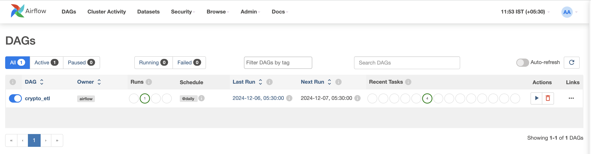
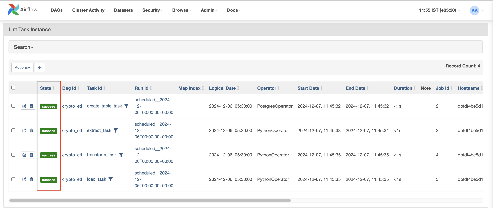
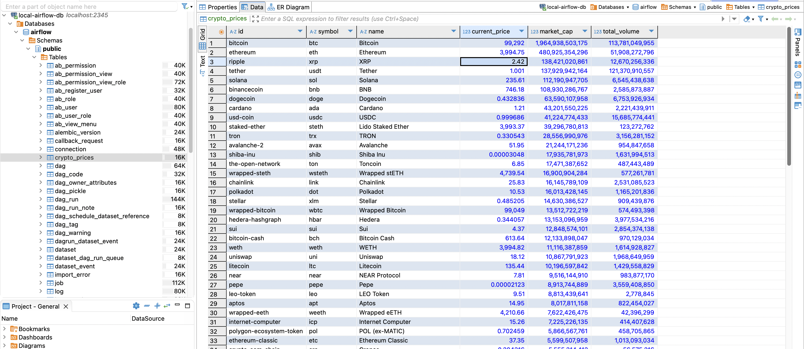

# 🚀 Crypto ETL Pipeline with Apache Airflow

## 📝 Overview
This project demonstrates a simple ETL (Extract, Transform, Load) pipeline that:
1. Extracts cryptocurrency data from CoinGecko API
2. Transforms the data to our desired format 
3. Loads it into a database for analysis

## 🔧 Initial Setup

1. Start the Airflow environment:
```bash
# Stop any existing containers and remove volumes
docker compose down -v

# Start the containers in detached mode
docker compose up -d

# Monitor the logs
docker compose logs -f
```

## ⚙️ Configure Data Connection in Airflow

Once Airflow is running, configure the database connection:

1. Open the Airflow UI (default: http://localhost:8080)
2. Navigate to Admin -> Connections
3. Click "Add new connection" with these settings:
   - Connection Id: `postgres_default`
   - Connection Type: `Postgres`
   - Host: `postgres`
   - Schema: `airflow`
   - Login: `airflow`
   - Password: `airflow`
   - Port: `5432`
4. Click "Save"

## 🏃 Running the ETL Pipeline 
1. Locate the crypto_etl DAG in the DAGs list


2. Toggle the switch from "Off" to "On" to enable the pipeline

3. The ETL process will now run daily to fetch latest crypto data

4. Monitor the pipeline execution

{width=400px, height=300px}

## 📊 Verifying the ETL Results

To check if the data was properly extracted and loaded:

```bash
# Connect to database
docker exec -it airflow-demo-postgres-1 psql -U airflow -d airflow

# Common Commands:
\dt                           # List all tables
SELECT * FROM crypto_prices;  # View extracted crypto data
\q                           # Exit CLI
```

## 🦫 Analyzing Data with DBeaver

For a more user-friendly way to analyze the ETL results:

1. Open DBeaver
2. Create a new connection (Ctrl+Shift+N)
3. Select PostgreSQL
4. Enter these connection details:
   - Host: `localhost`
   - Port: `2345`
   - Database: `airflow`
   - Username: `airflow`
   - Password: `airflow`
5. Test the connection and save
6. Browse the transformed crypto data through the GUI

